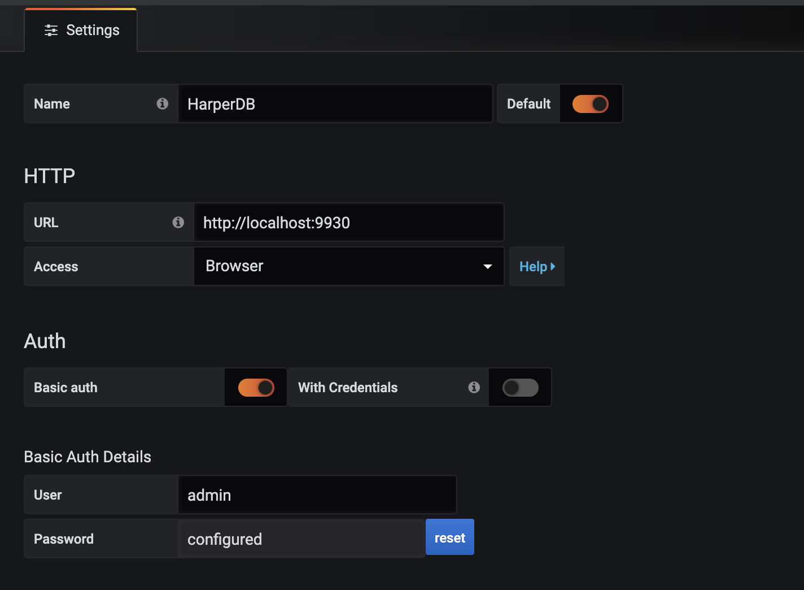
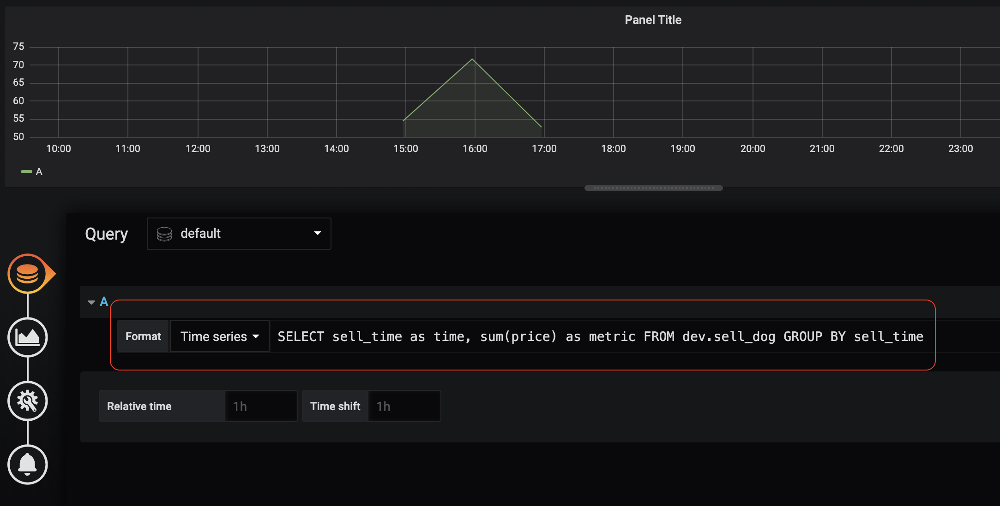

# Grafana HarperDB Datasource

## How to
1. Click add datasource
2. Select `HarperDB` plugin 
3. On settings 
   - Input URL with harperdb host

   - select accress with browser for now

   - Turn on Basic Auth and input username/password of HarperDB

    
4. On Dashboard, we can use sql query from HarperDB
 
    **FOR NOW** support only two columns from SQL result that we need to change column name to
    `time` and `metric`
    which
        
    `time` is timestamp type only

    `metric` is number type

    Example: 
    ```sql
    SELECT sell_time as time, sum(price) as metric FROM dev.sell_dog GROUP BY sell_time
    ```
    

## Development with Docker
1. `npm install`

2. `npm run dev`

3. Execute 
`./docker.sh` for starting this plugin in Docker Container

4. Open Grafana on http://localhost:3333 
 with `username: admin
 ` and 
 `password: admin`